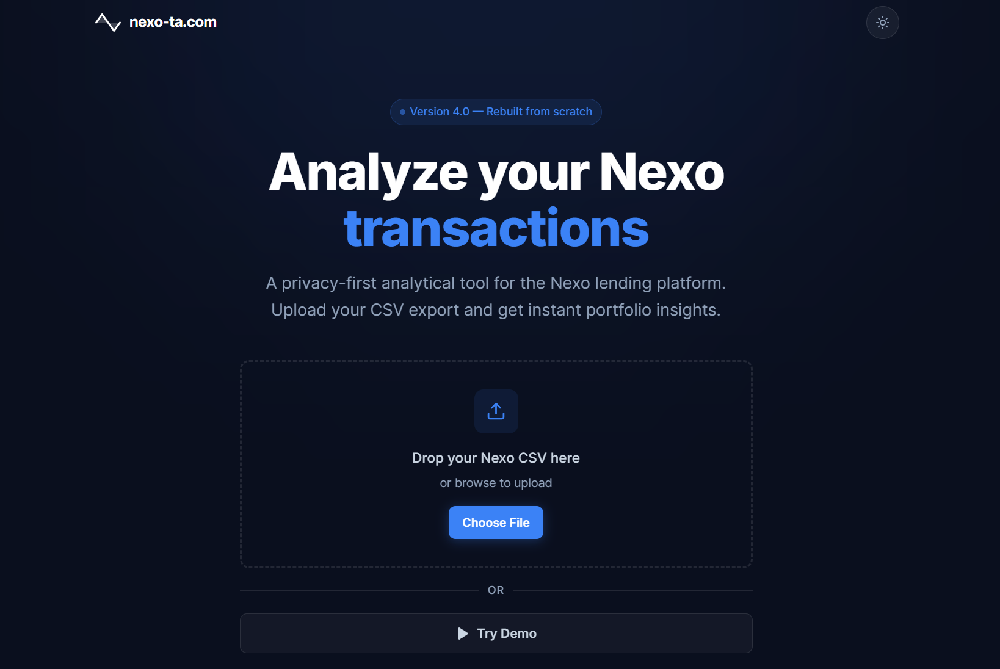
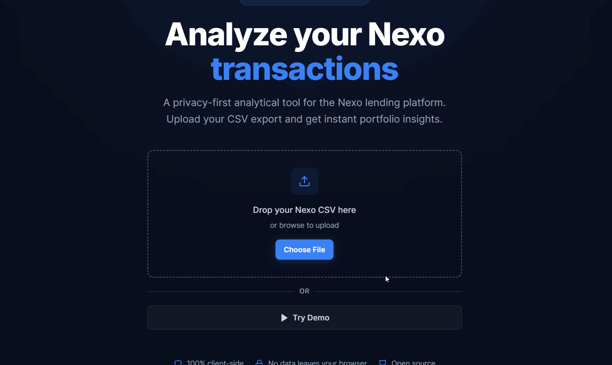

[](https://github.com/bandrewk/nexotransactionanalyzer/actions/workflows/ci.yml)
[](https://github.com/bandrewk/nexotransactionanalyzer/actions/workflows/deploy.yml)
[](https://github.com/bandrewk/nexotransactionanalyzer/actions/workflows/release.yml)
[](https://www.gnu.org/licenses/agpl-3.0)

# nexo-ta.com

A privacy-first analytical tool for the [Nexo](https://www.nexo.com) crypto lending platform. Upload your exported transaction `.csv` file and get instant portfolio insights — all processing happens locally in your browser.





## Features

### Portfolio Analytics
- Real-time portfolio value via CoinGecko, CryptoCompare, and frankfurter.app
- Historic portfolio value chart with daily close prices
- Portfolio distribution donut chart
- Performance metrics: Net Invested, Interest Earned, Unrealized P/L
- 1-week portfolio change on Dashboard
- Date range filtering on charts (1M, 3M, 6M, 1Y, All)

### Transaction Management
- Searchable, sortable, paginated transaction table
- Transaction type dropdown filter
- Blockchain explorer links for 19+ chains (BTC, ETH, SOL, XRP, ADA, DOT, etc.)
- Column visibility toggles (ID, Fee, Time)
- Support for all 27 Nexo transaction types

### Coinlist
- Holdings grid with coin icons and USD values
- Dust & residual balance section
- Zero balance toggle

### Interest Tracking
- Daily interest earned chart
- Per-currency interest breakdown with bar chart and table
- Disclaimer about Nexo CSV limitations for in-kind vs NEXO interest detection

### Other
- Dark mode (system default + manual toggle)
- Responsive design (desktop-first with mobile sidebar)
- Demo mode with realistic sample data
- Save/restore session via localStorage
- Crypto news feed (CoinDesk)

## Tech Stack

| Category | Technology |
|---|---|
| Build | Vite 8 |
| Framework | React 19 |
| Language | TypeScript 5.9 |
| State | Zustand |
| Styling | Tailwind CSS v4 |
| Charts | Recharts |
| Table | TanStack Table v8 |
| Icons | Lucide React |
| Unit Tests | Vitest |
| E2E Tests | Playwright |
| CI/CD | GitHub Actions + FTP Deploy |

## Getting Started

```bash
git clone https://github.com/bandrewk/nexotransactionanalyzer
cd nexotransactionanalyzer
npm install
npm run dev
```

No external services required. Currency metadata is bundled locally in `src/data/currencies.ts` and price data is fetched from CoinGecko, CryptoCompare, and frankfurter.app at runtime.

## Scripts

| Command | Description |
|---|---|
| `npm run dev` | Start dev server |
| `npm run build` | Production build |
| `npm run preview` | Preview production build |
| `npm run lint` | ESLint |
| `npm run typecheck` | TypeScript type checking |
| `npm run test` | Unit tests (Vitest) |
| `npm run test:e2e` | E2E tests (Playwright) |

## Testing

101 tests across 6 unit test suites and 17 E2E scenarios:

- **CSV Parser** — parsing, normalization (EURX→EUR), repayment/liquidation fixes, edge cases
- **Balance Calculator** — running balances, interest breakdown, deposit/withdrawal tracking, internal transfer skipping
- **TX Linkage** — blockchain explorer URL mapping for 19+ chains
- **Formatting** — USD, crypto amounts, percentages, edge cases
- **Storage** — localStorage save/load, version mismatch, corruption handling
- **Date Filter** — range filtering logic
- **E2E** — full demo flow, navigation, search, pagination, dark mode, save/restore

## CI/CD

The project uses three chained GitHub Actions workflows:

1. **CI** — Lint, typecheck, unit tests (Node 20/22/24 matrix), build, E2E tests
2. **Deploy** — FTP upload to production (triggers after CI passes on main)
3. **Release** — Creates a GitHub release from `CHANGELOG.md` (triggers after Deploy succeeds)

## Demo Data

A Python script (`generate_demo.py`) generates realistic sample transaction data for testing. The demo CSV covers ~1 year of transactions across 12+ currencies with all transaction types.

## Privacy

All CSV processing happens locally in your browser. No transaction data is ever sent to any server.

## Notice of Non-Affiliation and Disclaimer

We are not affiliated, associated, authorized, endorsed by, or in any way officially connected with Nexo Financial LLC, or any of its subsidiaries or its affiliates. The official Nexo Financial LLC website can be found at [nexo.com](https://www.nexo.com). The name NEXO as well as related names, marks, emblems and images are registered trademarks of their respective owners.

## Support Development

ETH: `0x6aa9da4a0f149a140f6813cbd84e1ee2df05e76e`

BTC: `bc1q5sl35at30wtftl4je7p0pwwxhwtekfe23602tj`

RVN: `RCJ92C29iZimha5H4Lw3GwKQQNiCMdd5dh`

## Previous Versions

- V3: [v3.nexo-ta.com](https://v3.nexo-ta.com/)
- V2: [v2.nexo-ta.com](https://v2.nexo-ta.com/)
- V1: [v1.nexo-ta.com](https://v1.nexo-ta.com/)
